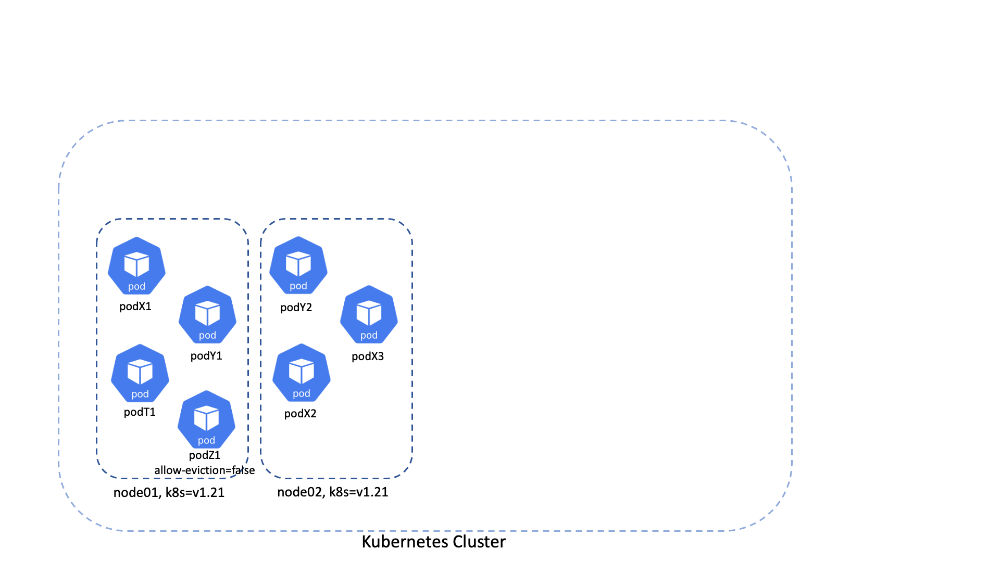

# k8s-shredder - a novel way of dealing with kubernetes nodes blocked from draining

[](https://github.com/adobe/k8s-shredder/actions/workflows/ci.yaml)
[](https://goreportcard.com/report/github.com/adobe/k8s-shredder)
[](https://pkg.go.dev/github.com/adobe/k8s-shredder?tab=doc)


[](https://opensource.org/licenses/Apache-2.0)

<p align="center">
  
</p>

A common issue that kubernetes operators run into is how to balance the requirements of long-running workloads with the need to periodically cycle through worker nodes (e.g. for a kubernetes upgrade or configuration change).  Stateful set workloads (kafka, zookeeper, 
rabbitmq, redis, etc) may be sensitive to rescheduling, or application developers may simply deploy applications with pod disruption budgets that do not allow pod eviction at all.  k8s-shredder is a tool that allows the operator to automatically try to soft-evict and reschedule workloads on "parked nodes" over a set period of time before hard-deleting pods.  It does so while exposing metrics that application stewards can monitor and take action, allowing them to take whatever action is needed to reschedule their application off the node slated for replacement.

## What are "parked nodes"?

You can find more about node parking [here](docs/node-parking.md).

## Advantages of parking nodes and shredding pods

- allow teams running stateful apps to move their workloads off of parked nodes at their will, independent of node lifecycle
- optimizes cloud costs by dynamically purging unschedulable workers nodes (parked nodes).
- notifies (via metrics) clients that they are running workloads on parked nodes so that they can take proper actions.

## Getting started

You can deploy k8s-shredder in your cluster by using the [helm chart](charts/k8s-shredder).

Then, during a cluster upgrade, while rotating the worker nodes, you will need to label the nodes and the non-daemonset pods it contains with labels similar to this:

```bash
shredder.ethos.adobe.net/parked-by=k8s-shredder
shredder.ethos.adobe.net/parked-node-expires-on=1750164865.36373
shredder.ethos.adobe.net/upgrade-status=parked
```

You can either park (e.g. label the nodes and pods) with your own cluster management tooling, or you can configure k8s-shredder to park nodes for you based on [karpenter node claim status](#karpenter-integration) or the presence of a [specific label on the node](#labeled-node-detection).

The following options can be used to customize the k8s-shredder controller:

| Name                               | Default Value                                               | Description                                                                                          |
| :--------------------------------: | :---------------------------------------------------------: | :--------------------------------------------------------------------------------------------------: |
| EvictionLoopInterval               | 60s                                                         | How often to run the eviction loop process                                                           |
| EvictionLoopSchedule               | ""                                                          | Optional cron schedule for when eviction operations are allowed. If set, parking and shredding operations will only occur during the scheduled time window. Supports standard cron syntax and macros (@yearly, @monthly, @weekly, @daily, @hourly). Example: "@daily" (runs at midnight UTC), "0 2 * * *" (runs at 2 AM UTC daily). When omitted, operations run continuously. |
| EvictionLoopDuration               | ""                                                          | Duration for how long the scheduled window stays active after the schedule triggers. Only used when EvictionLoopSchedule is set. Supports compound durations with hours and minutes (e.g., "10h5m", "30m", "160h"). Example: "10h" (window stays active for 10 hours), "30m" (window stays active for 30 minutes). |
| ParkedNodeTTL                      | 60m                                                         | Time a node can be parked before starting force eviction process                                     |
| RollingRestartThreshold            | 0.5                                                         | How much time(percentage) should pass from ParkedNodeTTL before starting the rollout restart process |
| UpgradeStatusLabel                 | "shredder.ethos.adobe.net/upgrade-status"                   | Label used for the identifying parked nodes                                                          |
| ExpiresOnLabel                     | "shredder.ethos.adobe.net/parked-node-expires-on"           | Label used for identifying the TTL for parked nodes                                                  |
| NamespacePrefixSkipInitialEviction | ""                                                          | For pods in namespaces having this prefix proceed directly with a rollout restart without waiting for the RollingRestartThreshold |
| RestartedAtAnnotation              | "shredder.ethos.adobe.net/restartedAt"                      | Annotation name used to mark a controller object for rollout restart                                 |
| AllowEvictionLabel                 | "shredder.ethos.adobe.net/allow-eviction"                   | Label used for skipping evicting pods that have explicitly set this label on false                   |
| ToBeDeletedTaint                   | "ToBeDeletedByClusterAutoscaler"                            | Node taint used for skipping a subset of parked nodes that are already handled by cluster-autoscaler |
| ArgoRolloutsAPIVersion             | "v1alpha1"                                                  | API version from `argoproj.io` API group to be used while handling Argo Rollouts objects             |
| EnableKarpenterDriftDetection      | false                                                       | Controls whether to scan for drifted Karpenter NodeClaims and automatically label their nodes        |
| EnableKarpenterDisruptionDetection | false                                                       | Controls whether to scan for disrupted Karpenter NodeClaims and automatically label their nodes      |
| ParkedByLabel                      | "shredder.ethos.adobe.net/parked-by"                        | Label used to identify which component parked the node                                               |
| ParkedNodeTaint                    | "shredder.ethos.adobe.net/upgrade-status=parked:NoSchedule" | Taint to apply to parked nodes in format key=value:effect                                            |
| EnableNodeLabelDetection           | false                                                       | Controls whether to scan for nodes with specific labels and automatically park them                  |
| NodeLabelsToDetect                 | []                                                          | List of node labels to detect. Supports both key-only and key=value formats                          |
| MaxParkedNodes                     | "0"                                                         | Maximum number of nodes that can be parked simultaneously. Can be an integer (e.g., "5") or percentage (e.g., "20%"). Set to "0" (default) for no limit. |
| ExtraParkingLabels                 | {}                                                          | (Optional) Map of extra labels to apply to nodes and pods during parking. Example: `{ "example.com/owner": "infrastructure" }` |
| EvictionSafetyCheck                | true                                                        | Controls whether to perform safety checks before force eviction. If true, nodes will be unparked if pods don't have required parking labels. |
| ParkingReasonLabel                 | "shredder.ethos.adobe.net/parked-reason"                   | Label used to track why a node or pod was parked (values: node-label, karpenter-drifted, karpenter-disrupted) |

### How it works

k8s-shredder will periodically run eviction loops, based on configured `EvictionLoopInterval`, trying to clean up all the pods from the parked nodes. Once all the pods are cleaned up, [cluster-autoscaler](

https://github.com/kubernetes/autoscaler/tree/master/cluster-autoscaler) or [karpenter](https://github.com/kubernetes-sigs/karpenter) should chime in and recycle the parked node.

The diagram below describes a simple flow about how k8s-shredder handles stateful set applications:



#### Karpenter Integration

k8s-shredder includes an optional feature for automatic detection of drifted Karpenter NodeClaims. This feature is disabled by default, but can be enabled by setting `EnableKarpenterDriftDetection` to `true`. When enabled, at the beginning of each eviction loop, the controller will:

1. Scan the Kubernetes cluster for Karpenter NodeClaims that are marked as "Drifted"
2. Identify the nodes associated with these drifted NodeClaims
3. Automatically process these nodes by:

   - **Labeling** nodes and their non-DaemonSet pods with:
       - `UpgradeStatusLabel` (set to "parked") 
       - `ExpiresOnLabel` (set to current time + `ParkedNodeTTL`)
       - `ParkedByLabel` (set to "k8s-shredder")
       - Any labels specified in `ExtraParkingLabels`
   - **Cordoning** the nodes to prevent new pod scheduling
   - **Tainting** the nodes with the configured `ParkedNodeTaint`

This integration allows k8s-shredder to automatically handle node lifecycle management for clusters using Karpenter, ensuring that drifted nodes are properly marked for eviction and eventual replacement.

#### Karpenter Disruption Detection

k8s-shredder includes an optional feature for automatic detection of disrupted Karpenter NodeClaims. This feature is disabled by default, but can be enabled by setting `EnableKarpenterDisruptionDetection` to `true`. When enabled, at the beginning of each eviction loop, the controller will:

1. Scan the Kubernetes cluster for Karpenter NodeClaims that are marked as disrupted (e.g., "Disrupting", "Terminating", "Empty", "Underutilized")
2. Identify the nodes associated with these disrupted NodeClaims
3. Automatically process these nodes by:

   - **Labeling** nodes and their non-DaemonSet pods with:
       - `UpgradeStatusLabel` (set to "parked") 
       - `ExpiresOnLabel` (set to current time + `ParkedNodeTTL`)
       - `ParkedByLabel` (set to "k8s-shredder")
       - Any labels specified in `ExtraParkingLabels`
   - **Cordoning** the nodes to prevent new pod scheduling
   - **Tainting** the nodes with the configured `ParkedNodeTaint`

This integration ensures that nodes undergoing disruption as part of bin-packing operations have all pods evicted in a reasonable amount of time, preventing them from getting stuck due to blocking Pod Disruption Budgets (PDBs). It complements the drift detection feature by handling nodes that are actively being disrupted by Karpenter's consolidation and optimization processes.

#### Labeled Node Detection

k8s-shredder includes optional automatic detection of nodes with specific labels. This feature is disabled by default but can be enabled by setting `EnableNodeLabelDetection` to `true`. When enabled, at the beginning of each eviction loop, the application will:

1. Scan the Kubernetes cluster for nodes that match any of the configured label selectors in `NodeLabelsToDetect`
2. Support both key-only (`"maintenance"`) and key=value (`"upgrade=required"`) label formats
3. Automatically process matching nodes by:

   - **Labeling** nodes and their non-DaemonSet pods with:
       - `UpgradeStatusLabel` (set to "parked") 
       - `ExpiresOnLabel` (set to current time + `ParkedNodeTTL`)
       - `ParkedByLabel` (set to "k8s-shredder")
       - Any labels specified in `ExtraParkingLabels`
   - **Cordoning** the nodes to prevent new pod scheduling
   - **Tainting** the nodes with the configured `ParkedNodeTaint`

This integration allows k8s-shredder to automatically handle node lifecycle management based on custom labeling strategies, enabling teams to mark nodes for parking using their own operational workflows and labels.  For example, this can be used in conjunction with [AKS cluster upgrades](https://learn.microsoft.com/en-us/azure/aks/upgrade-cluster#set-new-cordon-behavior).

#### Parking Limits with MaxParkedNodes

k8s-shredder supports limiting the maximum number of nodes that can be parked simultaneously using the `MaxParkedNodes` configuration option. This feature helps prevent overwhelming the cluster with too many parked nodes at once, which could impact application availability.

`MaxParkedNodes` can be specified as either:
- **Integer value** (e.g., `"5"`): Absolute maximum number of nodes that can be parked
- **Percentage value** (e.g., `"20%"`): Maximum percentage of total cluster nodes that can be parked (calculated dynamically each cycle)

When `MaxParkedNodes` is set to a non-zero value:

1. **Parse the limit**: The configuration is parsed to determine the actual limit
   - For percentages: `limit = (percentage / 100) * totalNodes` (rounded down)
   - For integers: `limit = configured value`
2. **Count parked nodes**: k8s-shredder counts the number of currently parked nodes
3. **Calculate available slots**: `availableSlots = limit - currentlyParked`
4. **Sort by age**: Eligible nodes are sorted by creation timestamp (oldest first) to ensure predictable parking order
5. **Limit parking**: If the number of eligible nodes exceeds available slots, only the oldest `availableSlots` nodes are parked
6. **Skip if full**: If no slots are available (currentlyParked >= limit), parking is skipped for that eviction interval

**Examples:**
- `MaxParkedNodes: "0"` (default): No limit, all eligible nodes are parked
- `MaxParkedNodes: "5"`: Maximum 5 nodes can be parked at any time
- `MaxParkedNodes: "20%"`: Maximum 20% of total cluster nodes can be parked (e.g., 2 nodes in a 10-node cluster)
- Invalid values (e.g., `"-1"`, `"invalid"`): Treated as 0 (no limit) with a warning logged

**Percentage Benefits:**
- **Dynamic scaling**: Limit automatically adjusts as cluster size changes
- **Proportional safety**: Maintains a consistent percentage of available capacity regardless of cluster size
- **Auto-scaling friendly**: Works well with cluster auto-scaling by recalculating limits each cycle

**Predictable Parking Order:**
Eligible nodes are **always sorted by creation timestamp (oldest first)**, regardless of whether `MaxParkedNodes` is set. This ensures:
- **Consistent behavior**: The same nodes will be parked first across multiple eviction cycles
- **Fair rotation**: Oldest nodes are prioritized for replacement during rolling upgrades
- **Predictable capacity**: You can anticipate which nodes will be parked next when slots become available
- **Deterministic ordering**: Even when parking all eligible nodes (no limit), they are processed in a predictable order

This sorting behavior applies to both Karpenter drift detection and node label detection features. When multiple nodes are eligible for parking:
- **With no limit** (`MaxParkedNodes: "0"`): All nodes are parked in order from oldest to newest
- **With a limit**: Only the oldest nodes up to the limit are parked; newer nodes wait for the next eviction interval

**Use cases:**
- **Gradual node replacement**: Control the pace of node cycling during cluster upgrades
- **Resource management**: Prevent excessive resource pressure from too many parked nodes
- **Application stability**: Ensure applications have sufficient capacity during node transitions
- **Cost optimization**: Balance between node replacement speed and cluster stability
- **Auto-scaling clusters**: Use percentage-based limits to maintain consistent safety margins as cluster size changes

#### ExtraParkingLabels

The `ExtraParkingLabels` option allows you to specify a map of additional Kubernetes labels that will be applied to all nodes and pods during the parking process. This is useful for custom automation, monitoring, or compliance workflows.

**Configuration:**
```yaml
ExtraParkingLabels:
  example.com/owner: "infrastructure"
  example.com/maintenance: "true"
  example.com/upgrade-batch: "batch-1"
```

**Use cases:**
- **Team ownership**: Mark parked nodes with team ownership labels for accountability
- **Maintenance tracking**: Add labels to track maintenance windows or upgrade batches
- **Compliance**: Apply labels required by compliance or governance policies
- **Monitoring**: Enable custom alerting or monitoring based on parking labels
- **Automation**: Trigger external automation workflows based on parking labels

**Behavior:**
- Labels are applied to both nodes and their non-DaemonSet pods during parking
- Labels are removed during the unparking process (if `EvictionSafetyCheck` triggers unparking)
- If not set or empty, no extra labels are applied
- Labels are applied in addition to the standard parking labels (`UpgradeStatusLabel`, `ExpiresOnLabel`, `ParkedByLabel`)

#### EvictionSafetyCheck

The `EvictionSafetyCheck` feature provides an additional safety mechanism to prevent force eviction of pods that weren't properly prepared for parking. When enabled (default: `true`), k8s-shredder performs a safety check before force evicting pods from expired parked nodes.

**How it works:**

1. **Before force eviction**: When a node's TTL expires and force eviction is about to begin, k8s-shredder checks all non-DaemonSet and non-static pods on the node
2. **Required labels check**: Each pod must have:
   - `UpgradeStatusLabel` set to "parked"
   - `ExpiresOnLabel` present with any value
3. **Safety decision**: 
   - If **all** pods have the required labels → proceed with force eviction
   - If **any** pod is missing required labels → unpark the node instead of force evicting

**Unparking process:**
When safety check fails, k8s-shredder automatically unparks the node by:
- Removing `ExpiresOnLabel` and `ExtraParkingLabels` from nodes and pods
- Removing the `ParkedNodeTaint`
- Uncordoning the node (making it schedulable again)
- Setting `UpgradeStatusLabel` to "unparked" on nodes and pods
- Setting `ParkedByLabel` to the configured `ParkedByValue`

**Use cases:**
- **Safety during manual parking**: If nodes are manually parked but pods weren't properly labeled
- **Partial parking failures**: When parking automation fails to label all pods
- **Emergency recovery**: Provides a safe way to recover from parking mistakes
- **Compliance**: Ensures only properly prepared workloads are force evicted

**Configuration:**
```yaml
EvictionSafetyCheck: true  # Enable safety checks (default)
EvictionSafetyCheck: false # Disable safety checks (force eviction always proceeds)
```

**Logging:**
When safety checks fail, k8s-shredder logs detailed information about which pods are missing required labels, helping operators understand why the node was unparked instead of force evicted.

#### Parking Reason Tracking

k8s-shredder automatically tracks why nodes and pods were parked by applying a configurable parking reason label. This feature helps operators understand the source of parking actions and enables better monitoring and debugging.

**Configuration:**
```yaml
ParkingReasonLabel: "shredder.ethos.adobe.net/parked-reason"  # Default label name
```

**Parking Reason Values:**
- `node-label`: Node was parked due to node label detection
- `karpenter-drifted`: Node was parked due to Karpenter drift detection
- `karpenter-disrupted`: Node was parked due to Karpenter disruption detection

**Behavior:**
- The parking reason label is applied to both nodes and their non-DaemonSet pods during parking
- The label is automatically removed during the unparking process (e.g., when safety checks fail)
- The label value corresponds to the detection method that triggered the parking action
- This label works alongside other parking labels and doesn't interfere with existing functionality

**Use cases:**
- **Monitoring**: Track which detection method is most active in your cluster
- **Debugging**: Understand why specific nodes were parked
- **Automation**: Trigger different workflows based on parking reason
- **Compliance**: Audit parking actions and their sources

#### EvictionLoopSchedule

k8s-shredder supports scheduling eviction operations to run only during specific time windows, similar to [Karpenter's disruption schedules](https://karpenter.sh/docs/concepts/disruption/#schedule). This feature allows you to restrict parking and shredding operations to maintenance windows or off-peak hours, minimizing disruption during critical business periods.

**How it works:**

When `EvictionLoopSchedule` and `EvictionLoopDuration` are configured:

1. **Schedule triggers**: The cron schedule determines when the operation window starts (e.g., `@daily` triggers at midnight UTC)
2. **Active window**: After the schedule triggers, operations remain active for the specified `EvictionLoopDuration` (e.g., `10h` means operations are allowed for 10 hours)
3. **Outside window**: When outside the active window, the eviction loop exits early with a log message indicating it's outside the operation schedule
4. **Continuous checking**: The eviction loop continues to run at the configured `EvictionLoopInterval`, but only performs operations when within the scheduled window

**Configuration:**

```yaml
EvictionLoopSchedule: "@daily"        # Cron schedule (supports macros and standard syntax)
EvictionLoopDuration: "10h"            # How long the window stays active
```

**Schedule Format:**

The schedule supports standard Kubernetes CronJob syntax with the following macros:

- `@yearly` or `@annually`: Runs at 00:00:00 UTC on January 1st
- `@monthly`: Runs at 00:00:00 UTC on the 1st of each month
- `@weekly`: Runs at 00:00:00 UTC on Sunday
- `@daily` or `@midnight`: Runs at 00:00:00 UTC each day
- `@hourly`: Runs at the top of each hour

Standard cron syntax is also supported:
```bash
# ┌───────────── minute (0 - 59)
# │ ┌───────────── hour (0 - 23)
# │ │ ┌───────────── day of the month (1 - 31)
# │ │ │ ┌───────────── month (1 - 12)
# │ │ │ │ ┌───────────── day of the week (0 - 6) (Sunday to Saturday)
# │ │ │ │ │
# * * * * *
```

**Duration Format:**

Duration supports compound durations with hours and minutes:
- `"10h"`: 10 hours
- `"30m"`: 30 minutes
- `"10h5m"`: 10 hours and 5 minutes
- `"160h"`: 160 hours

**Examples:**

1. **Daily maintenance window** (10 PM to 6 AM UTC):
```yaml
EvictionLoopSchedule: "0 22 * * *"    # 10 PM UTC daily
EvictionLoopDuration: "8h"            # Active for 8 hours (until 6 AM)
```

2. **Weekend-only operations**:
```yaml
EvictionLoopSchedule: "0 0 * * 0"     # Midnight UTC on Sunday
EvictionLoopDuration: "48h"           # Active for 48 hours (entire weekend)
```

3. **Business hours exclusion** (operations only outside 9 AM - 5 PM UTC):
```yaml
EvictionLoopSchedule: "0 17 * * 1-5"  # 5 PM UTC on weekdays
EvictionLoopDuration: "16h"           # Active until 9 AM next day
```

4. **Hourly maintenance windows**:
```yaml
EvictionLoopSchedule: "@hourly"        # Top of each hour
EvictionLoopDuration: "30m"           # Active for 30 minutes each hour
```

**Behavior:**

- **When schedule is configured**: Operations only occur during the active window
- **When schedule is omitted**: Operations run continuously (default behavior)
- **Schedule validation**: Both `EvictionLoopSchedule` and `EvictionLoopDuration` must be set together, or both omitted
- **Time zone**: All schedules are evaluated in UTC (consistent with Kubernetes CronJob behavior)
- **Logging**: When outside the schedule window, the eviction loop logs: `"Outside of operation schedule (schedule: ..., duration: ...), skipping eviction loop"`

**Use cases:**

- **Maintenance windows**: Restrict operations to scheduled maintenance periods
- **Business hours**: Avoid disruptions during peak business hours
- **Cost optimization**: Run operations during off-peak hours when resources are cheaper
- **Compliance**: Ensure operations only occur during approved time windows
- **Gradual rollouts**: Control when node cycling occurs during cluster upgrades

## Metrics

k8s-shredder exposes comprehensive metrics for monitoring its operation. You can find detailed information about all available metrics in the [metrics documentation](docs/metrics.md).

#### Creating a new release

See [RELEASE.md](RELEASE.md).
