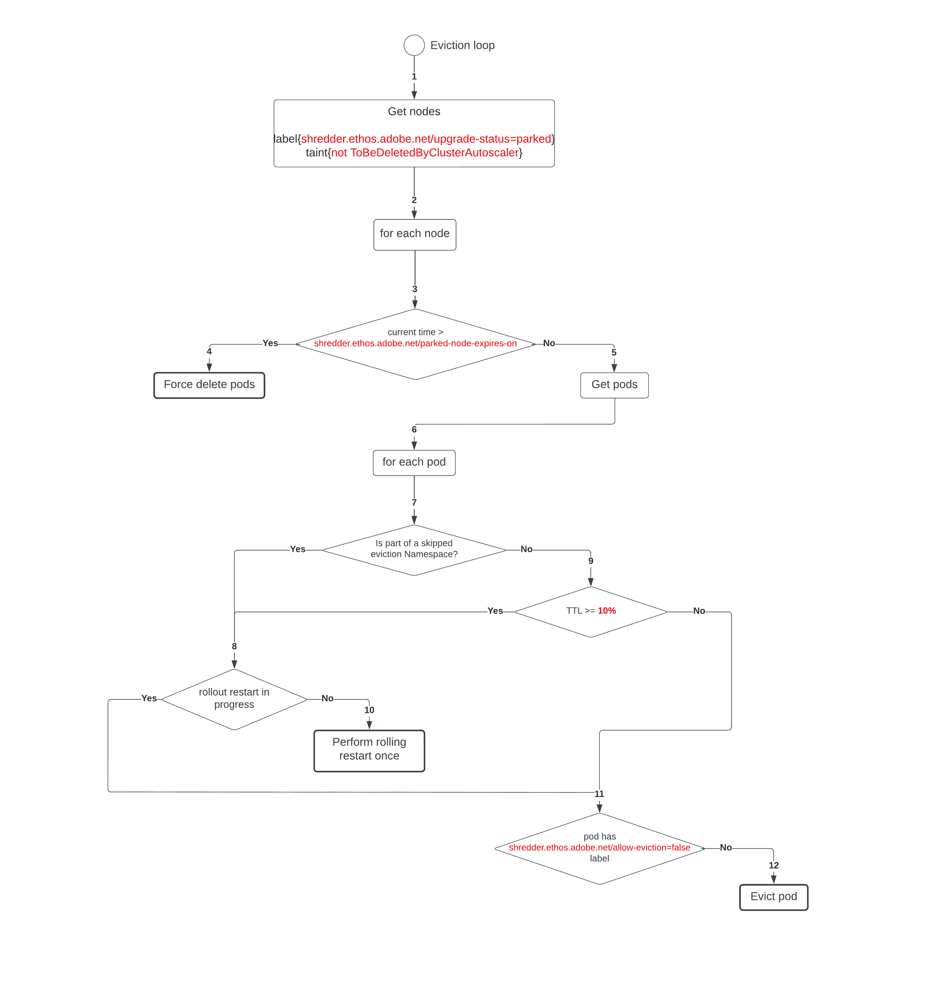

# Loop diagram

1. Get all nodes with `labels=shredder.ethos.adobe.net/upgrade-status=parked` and `taints!=ToBeDeletedByClusterAutoscaler`.
2. Loop through all parked nodes.
3. Check if the node has reached `shredder.ethos.adobe.net/parked-node-expires-on` time.
4. Force delete all pods from the node.
5. Get all pods from the parked node.
6. Loop through each pod.
7. Check if the pod is part of a skipped eviction namespace.
8. Check if the controller object that owns the pod has a rollout restart already in progress.
9. Check if the elapsed time is greater than the time node needs to be parked.
10. Perform a rollout restart of the controller object which owns the pod.
11. Check if the pod has the label `shredder.ethos.adobe.net/allow-eviction=false` attached.
12. Evict the pod.

